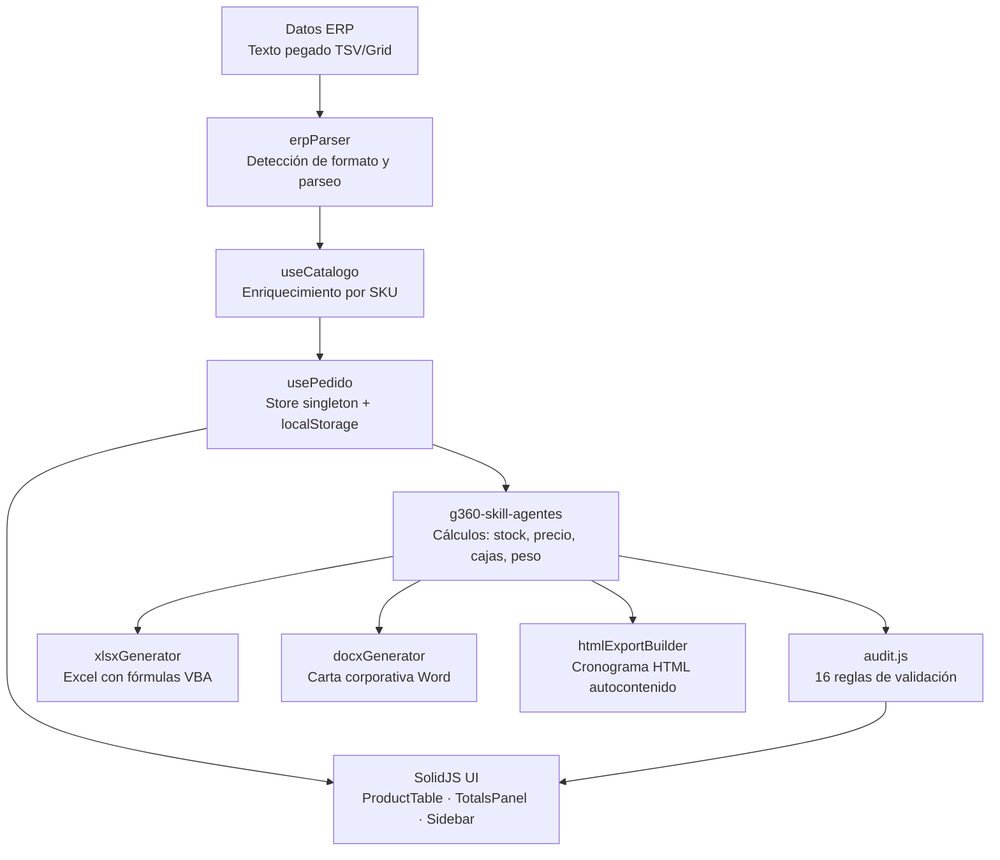

# g360-order-xlsx

<picture>
  
</picture>

> Aplicación web SolidJS para procesamiento inteligente de cotizaciones ERP/CRM de CIPSA.

[](https://github.com/carloscus/g360-order-xlsx)
[](https://github.com/carloscus/g360-cli)
[](https://www.solidjs.com)
[](https://opensource.org/licenses/MIT)

## ¿Cómo está organizado el proyecto?



## Tabla de Contenidos

- [Descripción](#descripción)
- [Características](#características)
- [Tecnologías](#tecnologías)
- [Instalación](#instalación)
- [Uso](#uso)
- [Estructura del Proyecto](#estructura-del-proyecto)
- [Scripts](#scripts)
- [Testing](#testing)
- [Ecosistema G360](#ecosistema-g360)

---

## Descripción

**G360 Order XLSX** es una aplicación web desarrollada en **SolidJS** para el procesamiento inteligente de cotizaciones ERP/CRM. Proporciona una interfaz para gestionar pedidos, distribuir productos, calcular totales, generar reportes en formato XLSX/DOCX/HTML y programar letras de pago.

La aplicación parsea texto pegado desde el ERP de CIPSA, enriquece los datos con un catálogo local de 1117+ productos, ejecuta cálculos de negocio (stock, precio, cajas, peso, distribución), valida el pedido con 16 reglas de auditoría, y exporta a múltiples formatos con branding corporativo.

**Tipo**: Aplicación Web / Herramienta ERP  
**Plataforma**: Navegador web (SPA)  
**Marca**: CIPSA — Corporación de Industrias Plásticas S.A.

---

## Características

### Gestión de Pedidos
- Parseo automático de texto ERP (formato TSV/Grid con auto-detección)
- Enriquecimiento de productos desde catálogo JSON
- Cálculo automático de subtotales, IGV (18%), y totales
- Persistencia automática en localStorage

### Tabla de Productos
- Interfaz tabular con 13+ columnas compatible con VBA
- Agregar, editar y eliminar productos
- Cálculos automáticos de precios, descuentos y estado de stock
- Footer con totales resumidos y badge de stock por fila

### Auditoría y Validaciones
- 16 reglas de auditoría configurables
- Panel de hallazgos con severidad: ERROR, WARNING, INFO, SUCCESS
- Categorías: STOCK, PRECIO, DESCUENTO, CANTIDAD, CATALOGO, VALIDACION, LOGISTICA

### Exportaciones
- **XLSX**: Excel con logo CIPSA, fórmulas SUMPRODUCT, badge de stock y formato condicional
- **DOCX**: Carta corporativa en Word con formato A4 y condiciones comerciales
- **HTML**: Cronograma autocontenido con toggle dark/light y gráficos
- **Impresión A4**: Print directo con tema claro forzado via `@media print`

### Distribución y Programación de Letras
- Calendario interactivo para selección de fechas de vencimiento
- Rango máximo de 12 meses consecutivos con indicador visual
- Cálculo automático de montos equitativos por letra
- KPIs: valor neto, unidades/caja, masa logística, total a financiar

### Distribución Visual (Butterfly Chart)
- Gráfico simétrico valor vs volumen por línea de producto
- Agrupamiento por línea, categoría y estado de línea

### UI/UX
- Tema oscuro/claro automático con persistencia en localStorage
- Sidebar navegable con acceso rápido a exportación
- Componentes modales arrastrables
- Diseño responsivo para móviles y desktop

---

## Tecnologías

| Categoría | Tecnología | Versión |
|-----------|-----------|---------|
| **Framework** | SolidJS | 1.8.0 |
| **Router** | @solidjs/router | 0.16.1 |
| **Build Tool** | Vite | 5.0.0 |
| **Lenguajes** | TypeScript + JavaScript | TS 5.4.0 |
| **Testing** | Vitest | 1.2.0 |
| **Export XLSX** | ExcelJS | 4.4.0 |
| **Export DOCX** | docx | 9.7.1 |
| **Identidad** | g360-signature | submodule |

---

## Instalación

### Prerrequisitos

- Node.js 18+ y npm
- Git

### Pasos

```bash
# 1. Clonar el repositorio
git clone https://github.com/carloscus/g360-order-xlsx.git
cd g360-order-xlsx

# 2. Instalar dependencias
npm install

# 3. Configurar submódulos (branding G360)
git submodule update --init --recursive

# 4. Ejecutar en desarrollo
npm run dev
```

La aplicación estará disponible en `http://localhost:5173`.

---

## Uso

### Flujo Básico

1. **Cargar datos del RPE**: Pegar texto del ERP en el área de importación (Ctrl+V)
2. **Revisar productos**: Editar precios, descuentos y cantidades en la tabla
3. **Auditar**: Verificar hallazgos del panel de auditoría
4. **Distribuir**: Navegar a `/distribucion` para programar letras de pago
5. **Exportar**: Generar XLSX, DOCX, HTML o imprimir en A4

### Rutas

| Ruta | Descripción |
|------|-------------|
| `/` | Página principal — carga ERP, gestión de productos, auditoría |
| `/distribucion` | Programación de letras, KPIs, butterfly chart, exportaciones |

---

## Estructura del Proyecto

```
g360-order-xlsx/
├── src/
│   ├── App.jsx                    # Shell de la app (layout)
│   ├── index.jsx                  # Entry point
│   ├── core/
│   │   ├── g360-engine.ts         # Sistema de diseño G360
│   │   ├── g360-skill-config.js   # Configuración de skills
│   │   └── g360-skill-agentes.js  # Cálculos de negocio
│   ├── hooks/
│   │   ├── usePedido.ts           # Store singleton
│   │   └── useCatalogo.js         # Catálogo + enriquecimiento
│   ├── services/
│   │   └── erpParser.js           # Parseo de texto ERP
│   ├── constants/
│   │   ├── audit.js               # 16 reglas de auditoría
│   │   └── sharedConstants.js     # Colores, IVA
│   ├── data/
│   │   ├── catalogo_productos.json
│   │   ├── feriados.json
│   │   └── initialData.json
│   ├── components/
│   │   ├── Header/
│   │   ├── Footer/
│   │   ├── ProductTable/
│   │   ├── TotalsPanel/
│   │   ├── PaymentSplit/
│   │   ├── Sidebar/
│   │   └── DistributionPage.jsx
│   └── utils/
│       ├── xlsxGenerator.ts
│       ├── docxGenerator.ts
│       └── htmlExportBuilder.js
├── package.json
├── vite.config.js
└── vitest.config.js
```

---

## Scripts

| Comando | Descripción |
|---------|-------------|
| `npm run dev` | Servidor de desarrollo con HMR |
| `npm run build` | Build de producción en `dist/` |
| `npm run preview` | Vista previa de producción |
| `npm run test` | Tests con Vitest |
| `npm run deploy` | Build + deploy a GitHub Pages |

---

## Testing

```bash
npm run test            # Ejecutar todos los tests
npm run test:watch      # Modo watch
```

---

## Ecosistema G360

Este proyecto forma parte del ecosistema **G360** para apoyo CRM y gestión de datos en CIPSA.

### Herramientas Relacionadas

- **[g360-cli](https://github.com/carloscus/g360-cli)** — Bootstrap de proyectos G360
- **[g360-signature](https://github.com/carloscus/g360-signature)** — Web component de branding G360
- **[g360-order-form](https://github.com/carloscus/g360-order-form)** — Sistema de gestión de pedidos
- **[g360-stock-reporter-lit](https://github.com/carloscus/g360-stock-reporter-lit)** — Reportes de stock con Lit
- **[g360-day-calculator](https://github.com/carloscus/g360-day-calculator)** — Calculadora de días laborables

---

## Licencia

Este proyecto es parte del ecosistema G360 y está sujeto a las políticas internas de la organización.

---

**Marca**: G360 · Microherramientas para apoyo CRM y datos en CIPSA  
**Isotipo**: 3 puntos verticales paralelos (gris-verde-gris) + chevron `>`  
**Signature**: G360 by ccusi · **Powered by**: [g360-signature](https://github.com/carloscus/g360-signature)
