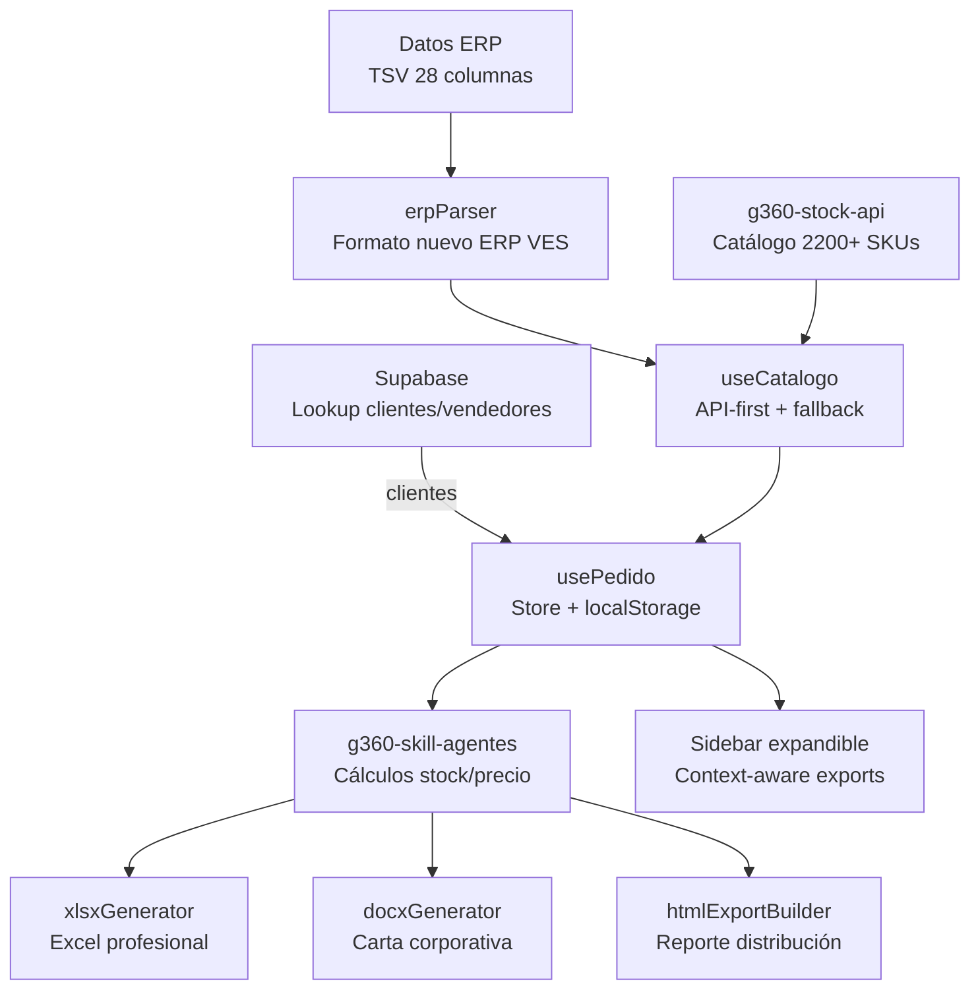

# g360-order-xlsx

<picture>
  
</picture>

> Aplicación web SolidJS para procesamiento inteligente de cotizaciones ERP/CRM de CIPSA.

[](https://github.com/carloscus/g360-order-xlsx)
[](https://github.com/carloscus/g360-cli)
[](https://www.solidjs.com)
[](https://opensource.org/licenses/MIT)

## ¿Cómo está organizado el proyecto?



## Tabla de Contenidos

- [Descripción](#descripción)
- [Novedades v6.0](#novedades-v60)
- [Características](#características)
- [Tecnologías](#tecnologías)
- [Instalación](#instalación)
- [Uso](#uso)
- [Estructura del Proyecto](#estructura-del-proyecto)
- [Ecosistema G360](#ecosistema-g360)

---

## Descripción

**G360 Order XLSX** es una aplicación web desarrollada en **SolidJS** para el procesamiento inteligente de cotizaciones ERP/CRM de CIPSA. Integra Supabase para lookup de clientes y vendedores, genera exports profesionales (XLSX, DOCX, HTML), y ofrece una interfaz moderna con sidebar expandible.

---

## Novedades v6.0

### 🆕 Integración Supabase
- **Lookup de clientes**: Autocomplete por RUC o código
- **Lookup de vendedores**: Auto-completado por ID
- Búsqueda prioriza coincidencia exacta en código

### 🎨 Paleta Corporativa Teal
- Accent: `#00796B` (Teal 700) — profesional, serio
- Success: `#10B981` (Emerald) — stock OK
- Warning: `#F59E0B` (Amber) — stock ajustado
- Error: `#EF4444` (Rose) — agotado

### 📊 XLSX Mejorado
- KPIs prominentes: Subtotal, Total+IGV, Stock Confirmado
- Columnas optimizadas (C, H = 125px, L = 160px)
- Logo tamaño: 2.89cm × 2.14cm
- Fórmulas corregidas (IGV = Subtotal × 0.18)

### 📝 DOCX Corporativo
- Carta formal para instituciones
- Tabla profesional con headers teal
- Email vendedor con dominio @cipsa.com.pe
- Logo tamaño: 2.89cm × 2.14cm

### 🌐 HTML Reporte
- Helper unificado (htmlHelper.js)
- Tabla optimizada para impresión A4
- Save + Download en una acción
- Dark/Light theme

### 🗂️ Sidebar Expandible
- Iconos + text labels
- Agrupación: Navegación / Acciones / Exportar / Sistema
- Context-aware: XLSX/DOCX en Home, HTML en Distribución
- Estado activo visual

### 🔍 Búsqueda de Productos
- Filtro por SKU, descripción o línea
- Contador de resultados
- Reset automático de paginación

### 🔔 Toast Notifications
- Feedback visual sin alert() bloqueantes
- Tipos: success, warning, error, info

### 📱 Formulario Context-Aware
- Cliente: Autocomplete por RUC/Código
- Vendedor: Auto-completado por ID
- Sucursal: Campo manual opcional
- Email: Dominio fijo @cipsa.com.pe

---

## Características

### Gestión de Pedidos
- Parseo de texto ERP (formato nuevo 28 columnas)
- Lookup de clientes desde Supabase
- Cálculo automático de subtotales, IGV (18%), y totales
- Persistencia en localStorage

### Tabla de Productos
- Búsqueda por SKU, descripción o línea
- 13+ columnas compatible con VBA
- Badges de stock con colores
- Paginación automática

### Exportaciones
- **XLSX**: Excel con fórmulas, KPIs, logo CIPSA
- **DOCX**: Carta corporativa con condiciones comerciales
- **HTML**: Reporte de distribución con gráficos
- **Print A4**: Impresión optimizada

### Distribución
- Calendario de letras de pago
- Gráfico mariposa por línea
- KPIs y categorías
- Bóveda de reportes HTML

---

## Tecnologías

| Categoría | Tecnología | Versión |
|-----------|-----------|---------|
| **Framework** | SolidJS | 1.8.0 |
| **Router** | @solidjs/router | 0.16.1 |
| **Build Tool** | Vite | 5.0.0 |
| **Base de Datos** | Supabase | @supabase/supabase-js |
| **Export XLSX** | ExcelJS | 4.4.0 |
| **Export DOCX** | docx | 9.7.1 |
| **Identidad** | G360 Design | Teal Corporativo |

---

## Instalación

```bash
# 1. Clonar
git clone https://github.com/carloscus/g360-order-xlsx.git
cd g360-order-xlsx

# 2. Instalar
npm install

# 3. Configurar Supabase (crear .env.local)
VITE_SUPABASE_URL=https://tu-proyecto.supabase.co
VITE_SUPABASE_ANON_KEY=tu-anon-key

# 4. Ejecutar
npm run dev
```

---

## Uso

### Flujo Principal

1. **Buscar cliente**: Escribir RUC o código en el autocomplete
2. **Cargar datos ERP**: Pegar texto del ERP (Ctrl+V)
3. **Completar pedido**: N° Pedido, Correo Vendedor
4. **Exportar**: XLSX (Home) o HTML (Distribución)

### Sidebar

| Página | Acciones |
|--------|----------|
| **Home** | Exportar → XLSX / DOCX |
| **Distribución** | Reporte → Guardar + Descargar HTML |

---

## Estructura del Proyecto

```
g360-order-xlsx/
├── src/
│   ├── components/
│   │   ├── Header/ClientInfo.jsx    # Autocomplete Supabase
│   │   ├── Sidebar/Sidebar.jsx      # Expandible context-aware
│   │   ├── Toast.jsx                # Notificaciones
│   │   └── ProductTable/            # Búsqueda + paginación
│   ├── hooks/
│   │   ├── useClientes.js           # Lookup Supabase
│   │   ├── useVendedor.js           # Lookup vendedor
│   │   └── usePedido.ts             # Store + idVendedor
│   ├── helpers/
│   │   └── htmlHelper.js            # Helper unificado HTML
│   ├── lib/
│   │   └── supabaseClient.js        # Cliente Supabase
│   ├── utils/
│   │   ├── xlsxGenerator.ts         # Excel profesional
│   │   ├── docxGenerator.ts         # Carta corporativa
│   │   └── htmlExportBuilder.js     # Reporte distribución
│   └── core/
│       └── g360-skill-config.js     # Paleta Teal
├── .env.local                       # Supabase credentials
└── package.json
```

---

## Ecosistema G360

- **[g360-cli](https://github.com/carloscus/g360-cli)** — Bootstrap de proyectos
- **[g360-stock-api](https://github.com/carloscus/g360-stock-api)** — API REST stock
- **[g360-master-data](https://github.com/carloscus/g360-master-data)** — Catálogo productos

---

**Marca**: G360 · Microherramientas para apoyo CRM en CIPSA  
**Paleta**: Teal Corporativo (#00796B)  
**Signature**: G360 by ccusi
