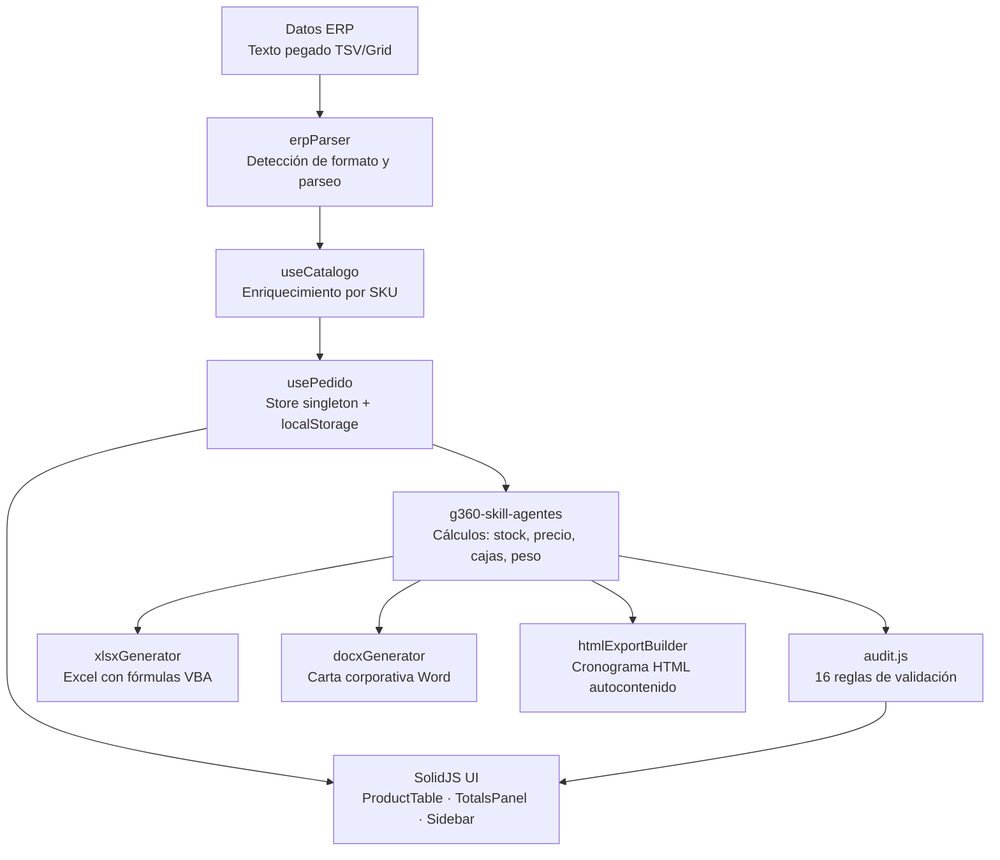
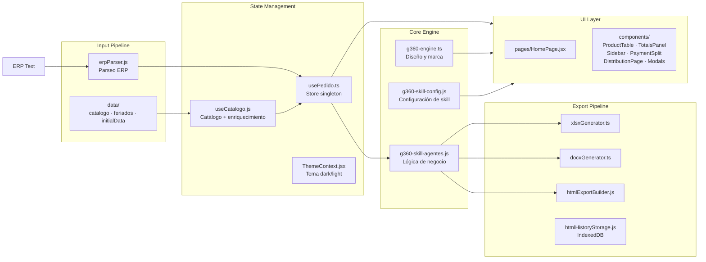

# G360 Order XLSX

<picture>
  
</picture>

> Aplicación web SolidJS para procesamiento inteligente de cotizaciones ERP/CRM de CIPSA. Forma parte de la familia de microherramientas G360 para apoyo CRM y gestión de datos en escritorio.

[](https://github.com/carloscus/g360-order-xlsx)
[](https://opensource.org/licenses/MIT)
[](https://www.solidjs.com)

---

## Arquitectura



---

## Tabla de Contenidos

- [Arquitectura](#arquitectura)
- [Descripción](#descripción)
- [Características](#características)
- [Tecnologías](#tecnologías)
- [Instalación](#instalación)
- [Uso](#uso)
- [Estructura del Proyecto](#estructura-del-proyecto)
- [Scripts](#scripts)
- [Testing](#testing)
- [Contribución](#contribución)
- [Licencia](#licencia)
- [Ecosistema G360](#ecosistema-g360)

---

## Descripción

**G360 Order XLSX** (CIPSA OrderX) es una aplicación web desarrollada en **SolidJS** para el procesamiento inteligente de cotizaciones ERP/CRM. Proporciona una interfaz para gestionar pedidos, distribuir productos, calcular totales, generar reportes en formato XLSX/DOCX/HTML y programar letras de pago.

La aplicación parsea texto pegado desde el ERP de CIPSA, enriquece los datos con un catálogo local de 1117+ productos, ejecuta cálculos de negocio (stock, precio, cajas, peso, distribución), valida el pedido con 16 reglas de auditoría, y exporta a múltiples formatos con branding corporativo.

**Tipo**: Aplicación Web / Herramienta ERP  
**Plataforma**: Navegador web (SPA)  
**Marca**: CIPSA — Corporación de Industrias Plásticas S.A.

---

## Características

### Gestión de Pedidos
- Parseo automático de texto ERP (formato TSV/Grid con auto-detección de variantes)
- Enriquecimiento de productos desde catálogo JSON (línea, categoría, peso, unidades/caja)
- Cálculo automático de subtotales, IGV (18%), y totales
- Persistencia automática en localStorage

### Tabla de Productos
- Interfaz tabular con 13+ columnas compatible con VBA
- Agregar, editar y eliminar productos
- Cálculos automáticos de precios, descuentos y estado de stock
- Footer con totales resumidos y badge de stock por fila

### Auditoría y Validaciones
- 16 reglas de auditoría configurables (stock, precio, descuento, catálogo, logística)
- Panel de hallazgos con severidad: ERROR, WARNING, INFO, SUCCESS
- Categorías: STOCK, PRECIO, DESCUENTO, CANTIDAD, CATALOGO, VALIDACION, LOGISTICA

### Exportaciones
- **XLSX**: Archivo Excel con logo CIPSA, fórmulas SUMPRODUCT, badge de stock y formato condicional
- **DOCX**: Carta corporativa en Word con formato A4, logo, márgenes profesionales y condiciones comerciales
- **HTML**: Cronograma autocontenido con toggle dark/light, header sticky, botón de impresión y gráficos
- **Impresión A4**: Print directo con tema claro forzado via `@media print`

### Distribución y Programación de Letras
- Calendario interactivo para selección de fechas de vencimiento
- Rango máximo de 12 meses consecutivos con indicador visual
- Cálculo automático de montos equitativos por letra
- Balance en tiempo real (asignado vs saldo)
- KPIs: valor neto, unidades/caja, masa logística, total a financiar

### Clasificación de Productos por Estado de Línea
- Campo `estado_linea` del catálogo JSON (fuente de verdad por SKU)
- Mapa de colores: NACIONAL (`#059669`), NUEVO (`#0891b2`), IMPORTADO (`#d97706`), TRADICIONAL (`#7c3aed`), PENDIENTE (`#6b7280`)
- Badge visual por fila y sección de agrupación en distribución

### Distribución Visual (Butterfly Chart)
- Gráfico simétrico valor vs volumen por línea de producto
- Cálculo de cajas centralizado: `cantidadUnd` (ERP) + `un_bx` (catálogo)
- Evaluación de stock: stock ERP vs `cantidadUnd` (columna 29)
- Agrupamiento por línea, categoría y estado de línea

### UI/UX
- Tema oscuro/claro automático con persistencia en localStorage
- Sidebar navegable con acceso rápido a exportación y atajos de teclado
- Componentes modales arrastrables para detalles y gráficos
- Diseño responsivo para móviles y desktop
- Branding G360/CIPSA integrado

---

## Tecnologías

| Categoría | Tecnología | Versión |
|-----------|-----------|---------|
| **Framework** | SolidJS | 1.8.0 |
| **Router** | @solidjs/router | 0.16.1 |
| **Build Tool** | Vite | 5.0.0 |
| **Lenguajes** | TypeScript + JavaScript | TS 5.4.0 |
| **Testing** | Vitest | 1.2.0 |
| **Export XLSX** | ExcelJS | 4.4.0 |
| **Export DOCX** | docx | 9.7.1 |
| **Styling** | CSS puro con variables CSS | — |
| **Identidad** | g360-signature | submodule |

---

## Instalación

### Prerrequisitos
- Node.js 18+ y npm
- Git

### Pasos

```bash
# 1. Clonar el repositorio
git clone https://github.com/carloscus/g360-order-xlsx.git
cd g360-order-xlsx

# 2. Instalar dependencias
npm install

# 3. Configurar submódulos (branding G360)
git submodule update --init --recursive

# 4. Ejecutar en desarrollo
npm run dev
```

La aplicación estará disponible en `http://localhost:5173`.

---

## Uso

### Flujo Básico

1. **Cargar datos del RPE**: Pegar texto del ERP en el área de importación (Ctrl+V)
2. **Revisar productos**: Editar precios, descuentos y cantidades en la tabla
3. **Auditar**: Verificar hallazgos del panel de auditoría
4. **Distribuir**: Navegar a `/distribucion` para programar letras de pago
5. **Exportar**: Generar XLSX, DOCX, HTML o imprimir en A4

### Rutas

| Ruta | Descripción |
|------|-------------|
| `/` | Página principal — carga ERP, gestión de productos, auditoría |
| `/distribucion` | Programación de letras, KPIs, butterfly chart, exportaciones |

### Temas

La aplicación detecta automáticamente el tema del sistema (oscuro/claro). Se puede alternar desde el sidebar.

---

## Estructura del Proyecto



### Archivos Principales

```
src/
├── App.jsx                          # Shell de la app (layout)
├── index.jsx                        # Entry point: router, temas, render
│
├── core/                            # Motor de diseño y negocio
│   ├── g360-engine.ts              # Sistema de diseño G360 (colores, efectos, layout)
│   ├── g360-skill-config.js        # Configuración de skills (full/marca/libre)
│   └── g360-skill-agentes.js       # Cálculos: valor venta, stock, cajas, peso, distribución
│
├── hooks/                           # Estado reactivo
│   ├── usePedido.ts                # Store singleton (cliente, productos, distribución)
│   └── useCatalogo.js              # Catálogo + enriquecimiento por SKU
│
├── services/                        # Integración externa
│   └── erpParser.js                # Parseo de texto ERP (TSV/Grid, auto-detección)
│
├── constants/                       # Reglas y constantes
│   ├── audit.js                    # 16 reglas de auditoría
│   ├── sharedConstants.js          # Colores de gráfico, IVA (1.18)
│   └── storage.js                  # Claves centralizadas de localStorage
│
├── data/                            # Datos estáticos
│   ├── catalogo_productos.json     # Catálogo de 1117+ productos
│   ├── feriados.json               # Calendario de feriados Perú
│   └── initialData.json            # Config: datos CIPSA, condiciones comerciales
│
├── components/                      # UI SolidJS
│   ├── Header/                     # Navbar + ClientInfo
│   ├── Footer/                     # Footer con g360-signature
│   ├── ProductTable/               # Tabla de productos (header, row, footer)
│   ├── TotalsPanel/                # Cards: Subtotal, IGV, Disponible
│   ├── PaymentSplit/               # Programación de letras
│   ├── Sidebar/                    # Navegación + exportación
│   ├── DistributionPage.jsx        # Página de distribución
│   ├── AuditPanel.jsx              # Panel de auditoría
│   ├── ChartModal.jsx              # Modal de gráficos (butterfly chart)
│   └── HistoryModal.jsx            # Historial de snapshots HTML
│
├── utils/                           # Utilidades puras
│   ├── xlsxGenerator.ts            # Generación Excel con fórmulas
│   ├── docxGenerator.ts            # Generación Word corporativa
│   ├── htmlExportBuilder.js        # Generación HTML autocontenido
│   ├── htmlHistoryStorage.js       # Persistencia IndexedDB
│   └── formatters.ts               # Formato moneda/numero (es-PE, S/)
│
├── pages/                           # Páginas
│   └── HomePage.jsx                # Página principal
│
├── context/                         # Contextos
│   └── ThemeContext.jsx            # Proveedor de tema dark/light
│
└── styles/                          # Estilos globales
    └── main.css                    # Variables de tema + estilos base
```

---

## Scripts

| Comando | Descripción |
|---------|-------------|
| `npm run dev` | Servidor de desarrollo Vite con hot reload |
| `npm run build` | Build de producción en `dist/` |
| `npm run preview` | Vista previa de la build de producción |
| `npm run test` | Ejecutar tests con Vitest |
| `npm run deploy` | Build + deploy a GitHub Pages |

---

## Testing

```bash
npm run test            # Ejecutar todos los tests
npm run test:watch      # Modo watch
```

Los tests usan **Vitest** y están configurados en `vitest.config.js`.

---

## Contribución

1. Fork el repositorio
2. Crear una rama: `git checkout -b feature/nueva-funcionalidad`
3. Commit: `git commit -m 'feat: agregar nueva funcionalidad'`
4. Push: `git push origin feature/nueva-funcionalidad`
5. Abrir un Pull Request

### Guías de Código

- **Framework**: SolidJS — usar signals y memos, no React hooks
- **Nomenclatura**: camelCase funciones/variables, PascalCase componentes, kebab-case CSS
- **Archivos**: `.tsx/.ts` para nuevos, `.jsx/.js` para existentes
- **Exports**: Named + default exports para componentes
- **Tests**: Agregar tests para nuevas funcionalidades
- **Commits**: Convención `feat:`, `fix:`, `docs:`, `refactor:`, `test:`

---

## Licencia

Este proyecto es parte del ecosistema G360 y está sujeto a las políticas internas de la organización.

---

## Ecosistema G360

Este proyecto forma parte de la familia de microherramientas **G360** para apoyo CRM y gestión de datos en escritorio, enfocadas en áreas como ventas, finanzas y logística.

### Herramientas Relacionadas

- **[g360-cli](https://github.com/carloscus/g360-cli)**: Bootstrap de proyectos G360
- **[g360-signature](https://github.com/carloscus/g360-signature)**: Web component de branding G360
- **[g360-order-form](https://github.com/carloscus/g360-order-form)**: Sistema de gestión de pedidos con interfaz móvil
- **[g360-stock-reporter-lit](https://github.com/carloscus/g360-stock-reporter-lit)**: Reportes de stock con Lit

---

**Marca**: G360 · Microherramientas para apoyo CRM y datos en escritorio  
**Isotipo**: 3 puntos verticales paralelos (gris-verde-gris) + chevron `>`  
**Signature**: G360 by ccusi (`mode: own`)  
**Autor**: Carlos Cusi  
**Desarrollo**: Con asistencia de herramientas de código IA (Vibe Code)  
**Powered by**: [g360-signature](https://github.com/carloscus/g360-signature)
