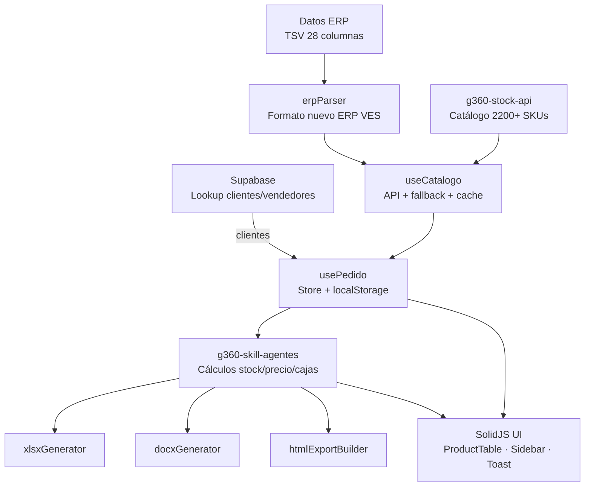

# g360-order-xlsx

<picture>
  
</picture>

> Aplicación web SolidJS para procesamiento inteligente de cotizaciones ERP/CRM de CIPSA.

[](https://github.com/carloscus/g360-order-xlsx)
[](https://github.com/carloscus/g360-cli)
[](https://www.solidjs.com)
[](https://opensource.org/licenses/MIT)

## ¿Cómo está organizado el proyecto?



## Tabla de Contenidos

- [Descripción](#descripción)
- [Novedades v6.0.0](#novedades-v600)
- [Características](#características)
- [Tecnologías](#tecnologías)
- [Instalación](#instalación)
- [Uso](#uso)
- [Estructura del Proyecto](#estructura-del-proyecto)
- [Scripts](#scripts)
- [Mantenimiento de Catálogo](#mantenimiento-de-catálogo)
- [Ecosistema G360](#ecosistema-g360)

---

## Descripción

**G360 Order XLSX** es una aplicación web desarrollada en **SolidJS** para el procesamiento inteligente de cotizaciones ERP/CRM de CIPSA. Integra Supabase para lookup de clientes y vendedores, genera exports profesionales (XLSX, DOCX, HTML) y ofrece una interfaz moderna con sidebar expandible.

**Tipo**: Aplicación Web / Herramienta ERP  
**Plataforma**: Navegador web (SPA)  
**Marca**: CIPSA — Corporación de Industrias Plásticas S.A.
**Paleta**: Azul corporativo (`#2563eb`)

---

## Novedades v6.0.0

### Integración Supabase
- **Lookup de clientes**: Autocomplete por RUC o código
- **Lookup de vendedores**: Auto-completado por ID
- Búsqueda prioriza coincidencia exacta en código

### Paleta Corporativa Azul
- **Acento**: `#2563eb` (azul) en lugar de verde neón
- **Header**: Gradiente azul corporativo (`#1e40af` → `#3b82f6`)
- **Colores de estado**: Success `#10b981`, Warning `#f59e0b`, Error `#f87171`

### Tablas Mejoradas (UI + HTML)
- **13 columnas** con `<colgroup>` (simetría real)
- **Encabezados a 2 líneas** (etiqueta corta + unidad debajo)
- **Ordenamiento** en headers (click → asc/desc con ▲▼)
- **Filtro de stock**: Todos / Con stock / Sin stock

### Nueva Columna: Cajas
- Muestra `cajasCompletas` y `unidadesSueltas` (en ámbar `+N`)
- Consistente en UI y HTML exportado

### Mantenimiento de Catálogo
- **Cache persistente** (localStorage) de lookups individuales
- **Pre-fetch** de SKUs faltantes antes de calcular
- Scripts de mantenimiento (`update-catalog`, `enrich-catalog`, `update-flags`)

### Correcciones
- `sin_catalogo` no divide por `un_bx` placeholder (evita cajas falsas)
- Footer de tabla alineado correctamente
- Descripción con clamp de 2 líneas (40 chars)
- Anchos de columna con porcentajes (suma 100%)

---

## Características

### Gestión de Pedidos
- Parseo de texto ERP (formato nuevo 28 columnas)
- Lookup de clientes/vendedores desde Supabase
- Persistencia en localStorage

### Tabla de Productos
- 13 columnas con colgroup simétrico
- Ordenamiento por headers
- Filtro de stock
- Búsqueda por SKU/descripción/línea
- Columna de Cajas para logística

### Exportaciones
- **XLSX**: Excel con fórmulas y KPIs
- **DOCX**: Carta corporativa Word
- **HTML**: Reporte de distribución (bóveda + descarga)
- **Print A4**: Impresión optimizada

---

## Tecnologías

| Categoría | Tecnología |
|-----------|-----------|
| **Framework** | SolidJS 1.8 |
| **Build** | Vite 5 |
| **Base de datos** | Supabase |
| **Export XLSX** | ExcelJS |
| **Presintation** | PptxGenJS |
| **Testing** | Vitest |

---

## Instalación

```bash
git clone https://github.com/carloscus/g360-order-xlsx.git
cd g360-order-xlsx
npm install
npm run dev
```

---

## Uso

### Flujo Principal
1. **Buscar cliente** (RUC o código)
2. **Pegar datos del ERP** (Ctrl+V)
3. **Revisar** tabla de partidas
4. **Exportar** (XLSX / DOCX / HTML)

---

## Estructura del Proyecto

```
g360-order-xlsx/
├── src/
│   ├── components/
│   │   ├── ProductTable/         # Tabla con sort/filtro
│   │   ├── Sidebar/              # Navegación + exportar
│   │   ├── DistributionPage.jsx
│   │   └── Toast.jsx
│   ├── helpers/
│   │   └── htmlHelper.js         # Generación HTML
│   ├── hooks/
│   │   ├── usePedido.ts
│   │   ├── useCatalogo.js
│   │   └── useClientes.js / useVendedor.js
│   ├── lib/
│   │   └── supabaseClient.js
│   ├── utils/
│   │   ├── xlsxGenerator.ts
│   │   ├── docxGenerator.ts
│   │   └── htmlExportBuilder.js
│   └── data/
│       └── catalogo_productos.json
├── scripts/                      # Mantenimiento
│   ├── update-catalog.cjs
│   ├── enrich-catalog.cjs
│   ├── update-flags.cjs
│   └── create-presentation.cjs
└── docs/
    └── CIPSA_OrderX_Guia_Uso.pptx
```

---

## Scripts

| Comando | Descripción |
|---------|-------------|
| `npm run dev` | Servidor desarrollo |
| `npm run build` | Build producción |
| `npm run deploy` | Build + deploy GitHub Pages |
| `npm run update-catalog` | Sincronizar catálogo desde API |
| `npm run enrich-catalog` | Enriquecer SKUs faltantes |
| `npm run presentation` | Regenerar PPTX |

---

## Mantenimiento de Catálogo

El catálogo local (`catalogo_productos.json`) tiene **2257 productos**. La API principal no incluye todos; los faltantes se resuelven via lookup individual con **cache persistente**.

```bash
npm run update-catalog     # Sincroniza con API (merge, preserva enriquecidos)
npm run enrich-catalog     # Agrega SKUs faltantes via lookup individual
node scripts/update-flags.cjs    # Actualiza flags sin_catalogo
```

### Flags importantes
- `sin_catalogo: true` → `un_bx` es placeholder (no confiable, se trata como 1 caja)
- `un_bx` → unidades por caja (del catálogo maestro)

---

## Ecosistema G360

- **[g360-cli](https://github.com/carloscus/g360-cli)** — Bootstrap de proyectos
- **[g360-stock-api](https://github.com/carloscus/g360-stock-api)** — API REST stock
- **[g360-master-data](https://github.com/carloscus/g360-master-data)** — Catálogo maestro

---

## Licencia

Proyecto interno — políticas de la organización.

---

**Marca**: G360 · Microherramientas para apoyo CRM y datos en CIPSA  
**Paleta**: Azul corporativo `#2563eb`  
**Signature**: G360 by ccusi · **Powered by**: [g360-signature](https://github.com/carloscus/g360-signature)
